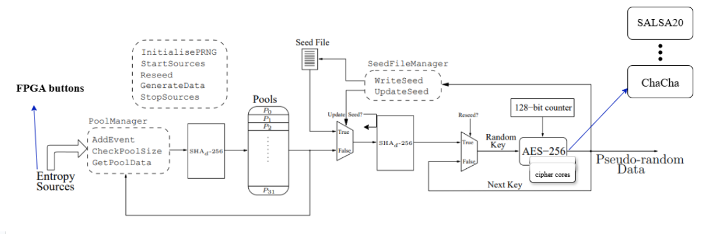
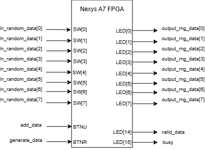
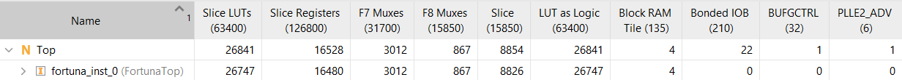
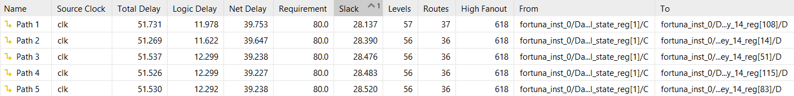
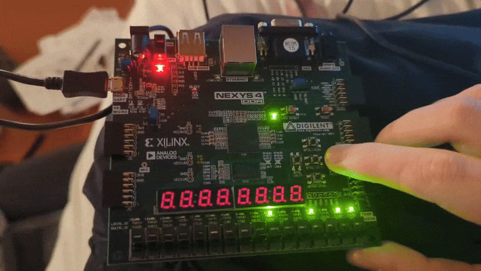

# Fortuna in Chisel

## 1. Introduction

The **Fortuna in Chisel** is a hardware design using **[Chisel](https://www.chisel-lang.org/)** that implements a **pseudo-random number generator (PRNG)** based on the  **[Fortuna algorithm](https://www.researchgate.net/publication/215858122_Fortuna_Cryptographically_Secure_Pseudo-Random_Number_Generation_In_Software_And_Hardware).** It translates the well-established Fortuna algorithm, originally specified for software, into a modular, synthesizable hardware architecture suitable for FPGA-based systems.

### 1.1 Core Architecture

The Figure 1 illustrates the architecture of Fortuna.

Figure 1. Fortuna Architecture.

#### 1.1.1 Seed Generator

The **Seed Generator** module is responsible for producing random seeds that serve as cryptographic keys for the Generator core. In this design, we utilize a **SHA-256** hashing engine to transform collected entropy into a  **256-bit hash value**, which is then used as the seed for Fortuna’s generator core.

#### 1.1.2. Pools

The **Pool** module is responsible for **storing 256-bit hash seeds** generated by the Seed Generator. These stored seeds act as the cryptographic keys used by the Generator core when producing random numbers. By separating the seed storage from the Seed Generator itself, the design ensures controlled reseeding and secure handling of previous seeds.

#### 1.1.3. Generator Core

The **Generator core** is the heart of Fortuna, it will produce the random number by utilizing seed as the encryption key and counter 128-bit as the plaintext. It will generate 128-bit random number. In this design, **AES-256** is used as the primary generator core, with **ChaCha** and **Salsa20** provided as alternative stream-cipher implementations.

## 2. Chisel Implementation

### 2.1 Project Overview

#### Milestones Planned

- [X] Setup Github Repo & include CI pipeline
- [X] Setup a Readme containing Project description
- [X] Build Seed Generator
- [X] Build Pools Module
- [X] Build Sha256 Module
- [X] Build AES-256 Cipher
- [X] build Salsa20 Module
- [X] Build ChaCha (Bernstein) Module
- [X] build and introduce Verilog Emitter
- [X] build Datapath
- [X] build FSM Module
- [X] build Fortuna Top Module
- [X] Pin Connections(xdc)
- [X] FPGA Implementation
- [X] Utilisation report
- [X] keystream size matrix achieved
- [ ] Introduce Cipher Selector Logic
- [ ] Performance matrix achieved

#### Future Implementations

- [ ] Security Matrix
- [ ] Twofish cipher Module
- [ ] Serpent cipher Module
- [ ] Camelia cipher Module
- [ ] Communication Module for data transfer FPGA - PC(UART,ethernet, SPI, PCIe) .

### 2.2 Project Layout

- **Sources**: `Agile-HW-Design-RNG/src/main/scala/`
  - `AES256.scala`  - AES‑256 (ECB core) with 256 bit key and 128 bit encrypted output.
  - `SHA256.scala` - Single‑block SHA‑256 core (iterative 64 rounds).
  - `SHAd256.scala` - Double SHA‑256 core: SHA‑256(SHA‑256(msg)).
  - `SHAd256_Multi.scala` - Multi-block double-hash engine that consumes concatenated pool data and emits SHA256(SHA256(msg)).
  - `ChaCha.scala` - ChaCha‑like 512‑bit keystream block generator.
  - `Salsa20.scala` - Salsa20 512‑bit keystream block generator.
  - `Emit.scala`  - `runMain` emitters for SystemVerilog generation.
  - `Pools.scala` - Simple seeding pools component for RNG reseeding logic.
  - `Datapath.scala` - Datapath for fortuna that orchestrates how entropy move through from Seed Generator to Generator Core.
  - `FSM.scala` - Fortuna Control State machine.
  - `FortunaTop.scala` - Top-level wrapper wiring the FSM with the datapath and exposing the RNG interface.
- **Tests**: `Agile-HW-Design-RNG/src/test/scala/`
  - `AES256Tester.scala` - AES-256 unit test that encrypts “abc” against a known vector.
  - `SHA256Tester.scala` - Single-block SHA-256 “abc” known-answer test.
  - `SHAd256Tester.scala` - Double SHA-256 “abc” known-answer test.
  - `PoolsTester.scala` - Pools module sanity test.
  - `CoSimulationTest.scala` - Co-simulation against Java golden models (AES, SHA256, SHAd256).
  - `DatapathTester.scala` - Datapath AES counter variation test.
  - `FortunaTopTester.scala` - End-to-end Fortuna top-level test.
  - `ChaChaTester.scala` - ChaCha vector test.
  - `Salsa20Tester.scala` - Salsa20 vector test.

### 2.3 Hardware Modules Descriptions

#### 2.3.1 SHA256 Module

Single-block SHA-256 core that follows FIPS 180-2 to hash a 512-bit message block (entropy in this project) into a 256-bit digest (as key for Generator Core in this project). Module implementation is based on [Secure Hash Standard Document](https://csrc.nist.gov/files/pubs/fips/180-2/final/docs/fips180-2.pdf) published by National Institute of Standards and Technology (NIST)

- IO (file: `Agile-HW-Design-RNG/src/main/scala/SHA256.scala`)

  - `io.in: UInt(512.W)` - pre‑padded 512‑bit message block.
  - `io.start: Bool` - start pulse; sample `io.in` and begin hashing.
  - `io.done: Bool` - high when digest is valid.
  - `io.out: UInt(256.W)` - hashed message

#### 2.3.2 SHAd256 Module

Implements the classic double-hash pipeline `SHA256(SHA256(msg))` for single 512-bit blocks.

- IO (file: `Agile-HW-Design-RNG/src/main/scala/SHAd256.scala`)
  - Same interface as `SHA256` (`in/start/ready/done/out`)

#### 2.3.3 SHAd256_Multi Module

`SHAd256_Multi.scala` extends the double-hash core so it can absorb up to 8 kbits of concatenated pool data, iterate through each 512-bit block, and then automatically hash the intermediate digest a second time with correct Fortuna padding. It produces the 256-bit reseed material that eventually becomes the AES key.

- IO (file: `Agile-HW-Design-RNG/src/main/scala/SHAd256_Multi.scala`)
  - `io.shaBlocks: UInt(8192.W)` - packed pool data plus padding bits that form the first SHA-256 input.
  - `io.nbMsgBlocks: UInt(5.W)` - number of 512-bit blocks that should be processed before launching the second hash.
  - `io.start: Bool` / `io.done: Bool` - handshake for kicking off and detecting completion of the double hash.
  - `io.out: UInt(256.W)` - final SHA256(SHA256(msg)) digest handed to the datapath.

#### 2.3.4 AES256 Module

Hardware AES-256 core that encrypts 128-bit blocks (counter in this project) using a 256-bit key via start/done handshakes. Module implementation is based on [Advanced Encryption Standard Document](https://nvlpubs.nist.gov/nistpubs/FIPS/NIST.FIPS.197-upd1.pdf) published by National Institute of Standards and Technology (NIST)

- IO (file: `Agile-HW-Design-RNG/src/main/scala/AES256.scala`)
  - `io.in_data: UInt(128.W)` - plaintext block.
  - `io.in_key: UInt(256.W)` - cipher key.
  - `io.start: Bool`, `io.ready: Bool`, `io.done: Bool` - handshake.
  - `io.out: UInt(128.W)` - ciphertext block output.

#### 2.3.5 Pools Module

Implements Fortuna's 32 entropy pools, managing masked reads for reseeding and clearing pools once they are consumed.

- IO (file: `Agile-HW-Design-RNG/src/main/scala/Pools.scala`)
  - `io.inData: UInt(256.W)` - new hashed seed.
  - `io.writePool: Bool` - start write inData into pools.
  - `io.readPool: Bool` - uses an internal reseed counter to generate a mask over the 32 pools and clear used pools when reseeding.
  - `io.notEnoughDataFlag: Bool` - indicates data in the pools is not enough.
  - `io.outPoolsCount: UInt(5.W))` - number of pools included in output.
  - `io.outSeedingData: Vec(32, UInt(256.W))` - masked pool data.
  - `io.outUpdateData: UInt(32.W)` - current pool’s data.

#### 2.3.6 Datapath Module

Ties together the SHA cores, pools, stored seed register, and AES generator so entropy bytes can be ingested, reseeded, and finally turned into 128-bit keystream blocks (random number).

- IO (file: `Agile-HW-Design-RNG/src/main/scala/Datapath.scala`)
  - `io.in_data: UInt(8.W)` - external entropy byte stream.
  - `io.SHAd_a_en/io.SHAd_a_done: Bool` - control handshake for the single-block SHA when ingesting data.
  - `io.SHAd_b_en/io.SHAd_b_done: Bool` - handshake for the multi-block SHAd256 that produces reseed material.
  - `io.Pools_writeData/io.Pools_readData: Bool` - strobes that insert entropy or request masked pool outputs.
  - `io.Cipher_en/io.Cipher_done: Bool` - drives the AES256 generator.
  - `io.useStoredSeed/io.updateStoredSeed: Bool` - select between the stored seed and freshly hashed pool seed, and capture a refreshed stored seed chunk when desired.
  - `io.out: UInt(128.W)` - latest 128-bit AES block (random number).
  - `io.Pools_notEnoughDataFlag: Bool` - indicates whether the pools contain enough entropy for reseeding.

#### 2.3.7 FSM Module

This FSM coordinates when the system generates keys, generates output data, or adds entropy to a pool, depending on request signals and completion signals of SHA engines and cipher engines. The Figure 2 below illustrates the state diagram of the machine.

Figure 2. FSM Diagram.

- IO (file: `Agile-HW-Design-RNG/src/main/scala/FSM.scala`)
  - `io.add_data: Bool` / `io.generate_data: Bool` - host commands to insert entropy or request output.
  - `io.busy: Bool` / `io.valid_data: Bool` - status flags published to the host.
  - `io.SHAd_a_en`, `io.SHAd_b_en`, `io.Pools_writeData`, `io.Pools_readData`, `io.Cipher_en`, `io.useStoredSeed`, `io.updateStoredSeed`: Bool control signals driven into the datapath.
  - `io.SHAd_a_done`, `io.SHAd_b_done`, `io.Cipher_done`, `io.Pools_notEnoughDataFlag`: Bool feedbacks consumed by the FSM to sequence operations.

#### 2.3.8 Fortuna Top Module

Thin integration wrapper instantiating `FSM` plus `Datapath` and exposing the simplified RNG interface to the outside world.

- IO (file: `Agile-HW-Design-RNG/src/main/scala/Top.scala`)
  - `io.add_data: Bool` / `io.generate_data: Bool` - replicated host requests forwarded to the FSM.
  - `io.in_random_data: UInt(8.W)` - entropy byte stream that feeds the datapath.
  - `io.out_rng_data: UInt(128.W)` - Random number output.
  - `io.busy: Bool` / `io.valid_data: Bool` - status indicators sourced from the FSM.

#### 2.3.9 ChaCha Module

Alternative chiper module for generator core. Module implementation is based on [ChaCha by  Daniel J. Bernstein](https://cr.yp.to/chacha/chacha-20080128.pdf).

- IO (file: `Agile-HW-Design-RNG/src/main/scala/ChaCha.scala`)
  - `io.start: Bool` - start pulse, telling core to capture `in_key`, `in_nonce`, and `in_counter` and begin computing.
  - `io.in_key: UInt(256.W)` - 256‑bit ChaCha key.
  - `io.in_nonce: UInt(64.W)` - 64‑bit nonce.
  - `io.in_counter: UInt(64.W)` - 64‑bit block counter.
  - `io.out: UInt(521.W)` - The 512‑bit ChaCha keystream block
  - `io.done: Bool` - Done or valid flag

#### 2.3.10 Salsa20 Module

Alternative cipher module for generator core. Salsa20 is also proposed by  Daniel J. Bernstein. It is an older version of Chacha.

- IO (file: `Agile-HW-Design-RNG/src/main/scala/Salsa20.scala`)
  - Same interface as `ChaCha` (`in_start/in_key/in_nonce/in_counter/out_Decoding_key/out_ready`)

### 2.4 Testing

* **AES256Tester** `(src/test/scala/AES256Tester.scala)`
  Encrypts **"abc"** using the AES-256 core and compares against the expected ciphertext.
* **SHA256Tester** `(src/test/scala/SHA256Tester.scala)`
  Hashes a padded **"abc"** block and checks the standard SHA-256 known answer.
* **SHAd256Tester** `(src/test/scala/SHAd256Tester.scala)`
  Runs the double-hash engine on **"abc"** and validates the resulting digest.
* **PoolsTester** `(src/test/scala/PoolsTester.scala)`
  Exercises pool writes, reseed masking, and `outPoolsCount` behavior for different counters.
* **CoSimulationTest** `(src/test/scala/CoSimulationTest.scala)`
  Co-simulates AES256, SHA256, and SHAd256 against Java `Cipher`/`MessageDigest` references using shared golden models.
* **DatapathTester** `(src/test/scala/DatapathTester.scala)`
  Drives the datapath AES path standalone to ensure counter outputs differ when reusing the stored seed.
* **FortunaTopTester** `(src/test/scala/FortunaTopTester.scala)`
  Stimulates the Fortuna top interface (generate pulses, busy tracking, RNG readout) to confirm the integrated FSM/datapath emits fresh blocks each request.
* **ChaChaTester** `(src/test/scala/ChaChaTester.scala)`
  Runs the ChaCha core on known vectors and checks the 512-bit `out_Decoding_key`.
* **Salsa20Tester** `(src/test/scala/Salsa20Tester.scala)`
  Validates the Salsa20 keystream against reference outputs using the same interface as ChaCha.

### 2.5 Support Code

* **Emit** `(Agile-HW-Design-RNG/src/main/scala/Emit.scala)` - SBT entry points to emit SystemVerilog:
  * **AES256Emit**: Emitting SystemVerilog for AES256 module
  * **SHA256Emit**: Emitting SystemVerilog for SHA256 module
  * **SHAd256Emit**: Emitting SystemVerilog for SHAd256 module
  * **PoolsEmit**:  Emitting SystemVerilog for Pools module
  * **ChaChaEmit**:  Emitting SystemVerilog for ChaCha module
  * **Salsa20Emit**:  Emitting SystemVerilog for Salsa20 module
  * **FSMEmit**:  Emitting SystemVerilog for FSM module
  * **DatapathEmit**:  Emitting SystemVerilog for Datapath module
  * **SHAd256_MultiEmit**:  Emitting SystemVerilog for SHAd256_Multi module
  * **FortunaTopEmit**:  Emitting SystemVerilog for Fortuna Top module

### 2.6 Build & Test

- Requirements: JDK 17+, `sbt`, Scala 2.13, Chisel 6.7.0, and chiseltest 6.0.0.
- Run all tests: `sbt test`
- Run a specific test e.g: `sbt "testOnly *SHA256Tester"`, `sbt "testOnly *SHAd256Tester"`, or `sbt "testOnly *AES256Test"`.

### 2.7 SystemVerilog Generation

- Run from `Agile-HW-Design-RNG` directory with sbt:
  - `sbt "runMain AES256Emit"` → emits SV for AES256 into `generated/`.
  - `sbt "runMain SHA256Emit"` → emits SV for SHA256 into `generated/`.
  - `sbt "runMain SHAd256Emit"` → emits SV for SHAd256 into `generated/`.
  - `sbt "runMain PoolsEmit"` → emits SV for Pools into `generated/`.
  - `sbt "runMain DatapathEmit"` → emits SV for Datapath into `generated/`.
  - `sbt "runMain FSMEmit"` → emits SV for FSM into `generated/`.
  - `sbt "runMain SHAd256_MultiEmit"` → emits SV for SHAd256 Multi into `generated/`.
  - `sbt "runMain ChaChaEmit"` → emits SV for ChaCha into `generated/`.
  - `sbt "runMain Salsa20Emit"` → emits SV for Salsa20 into `generated/`.
  - `sbt "runMain FortunaTopEmit"` → emits SV for FortunaTop Module into `generated/`.

## 3. FPGA Implementation

The design was implemented on a Nexys A7 FPGA development board. The SystemVerilog files used for the implementation are located under `Agile-HW-Design-RNG/fpga` folder. 

### 3.1 Connection Diagram

In this project, switches are used to provide entropy inputs, and LEDs are used to display the generated random numbers. Some buttons are assigned to trigger the collection of entropy and to start the generator process. Additional LEDs serve as indicators for the valid and busy signals.

Figure 3. Connection Diagram.

### 3.2 Resource Utilization

The design uses about 41% of the available slice LUTs and 13% of slice registers of Nexys A7 FPGA. Figure 4 illustrates details of the resource utilization for the design.

Figure 4. Resource Utilization.

### 3.3 Timing Report

Figure 5 reports the critical clock paths inside the design. Each path has a total delay around 52-53 ns and satisfies the requirement.

Figure 5. Timing Report.

### 3.4 Video Demo

The implementation demo can be seen in the Video 1 below. The FPGA generates random numbers and displays them on the LEDs when the data-generation button is pressed.

Video 1. FPGA Implementation Demo.

